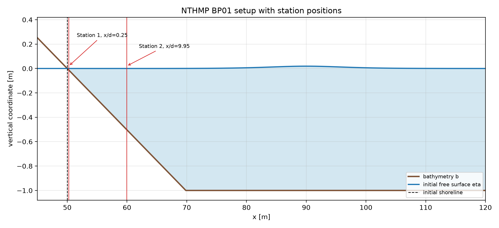
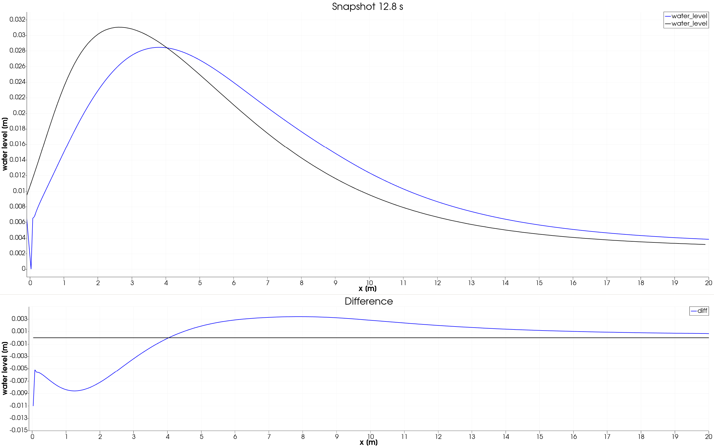
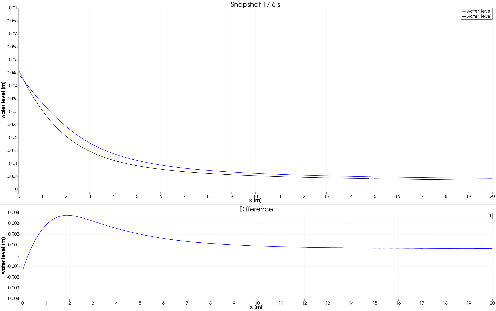
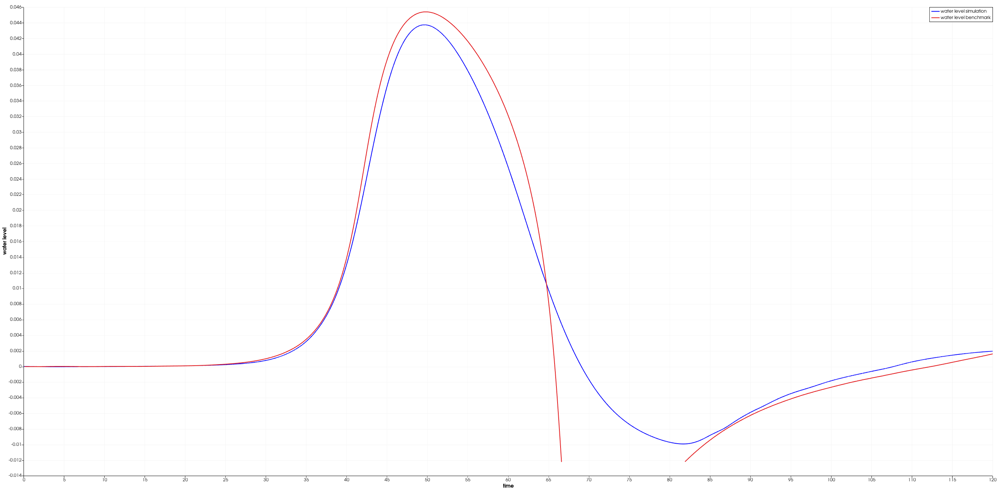
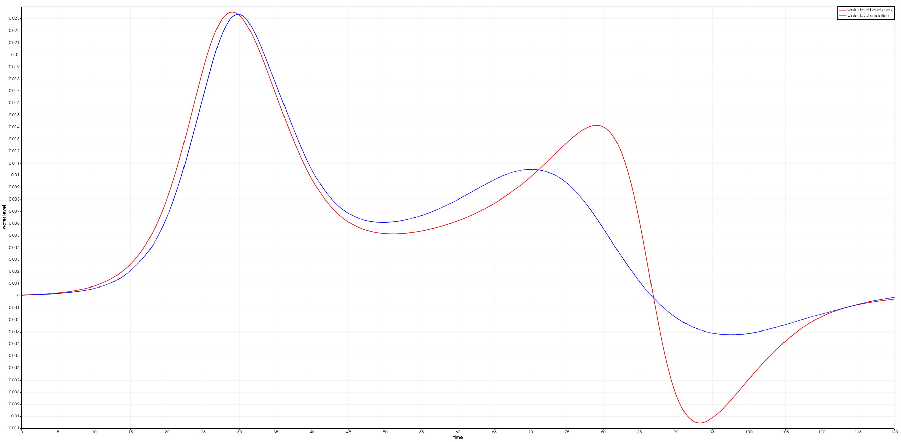

Validierung mit Benchmarks
==========================

NTHMP BP01: Solitaerwelle auf einfachem Strand
----------------------------------------------

.. image:: ../../images/benchmarks/bp01_hybrid_manning_0_04.gif

test

.. image:: ../../images/benchmarks/nthmp_bp01_wave.gif