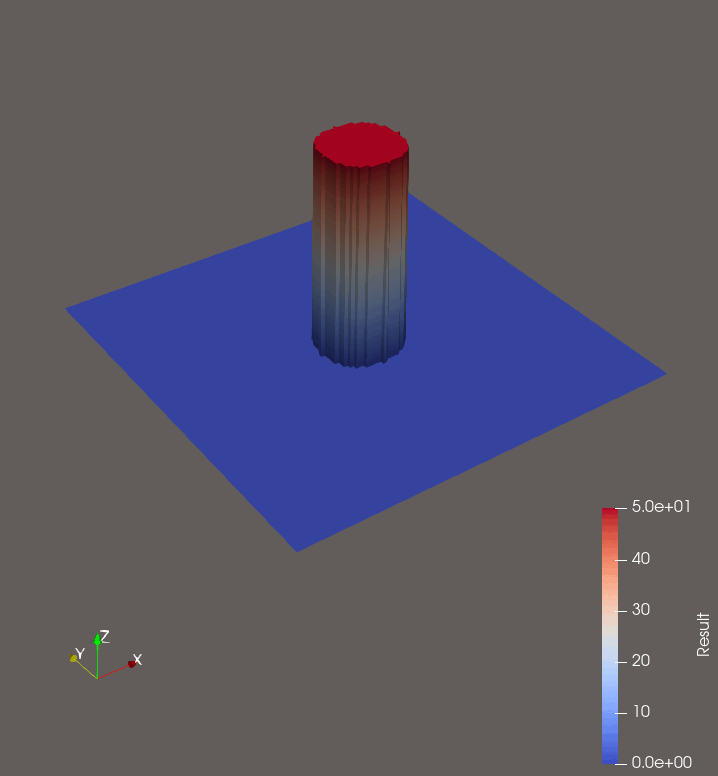
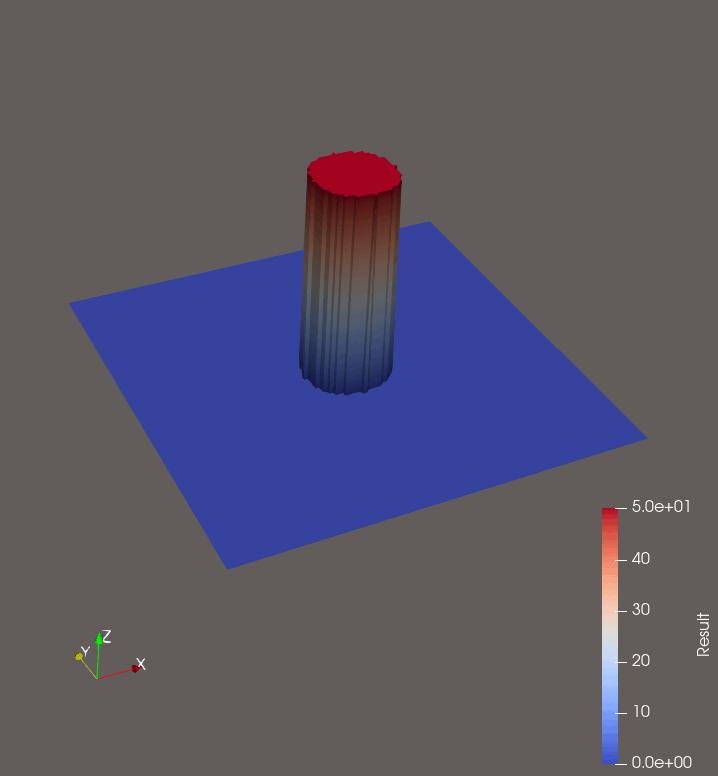

Woche 11
========

In der zweiten Woche der individual Phase haben wir den HLLE-Solver, die Manning Reibung
und die hydrostatische Rekonstruktion auf 2D erweitert und ein 
2D Trocken/Nass Dammbruch Problem gelöst.

**2D Trocken/Nass Dammbruch**

Bei diesem Setup ist zu erkennen, dass die Wellen nicht gleichmäßig verteilt werden,
sondern die x und y Richtungen bevorzugt werden. Dies liegt daran, dass wir 
aktuell im x-sweep nur in die x Richtung ableiten und im y-sweep nur in die y richtung.
Da wir hier ein realistisches Ergebnis erziehlen wollten, haben wir den 
HLLE-Solver angepasst, sodass dieser auch die tangentialen Richtungen ableitet. 
Also im x-sweep wird auch ein Update für die y Richtung berechnet und umgekehrt.
Diese Verbesserung führt zu folgendem Ergebnis:

**2D Trocken/Nass Dammbruch mit angepasstem HLLE-Solver**

Als letztes wollten wir noch ein Dammbruch mit Bathymetry simulieren. Auch da 
gab es zunächst Probleme, welche aus einem Bug in der Implemetierung der 
hydrostatischen Rekonstruktion entsprungen. Nach dem wir diesen Fehler behoben haben
konnten wir folgende Visualisierung erstellen:

**2D Dammbruch mit Bathymetry**

.. image:: ../images/circular-dambreak-bathymetry.gif

