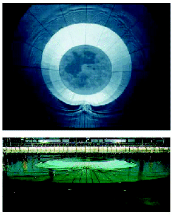
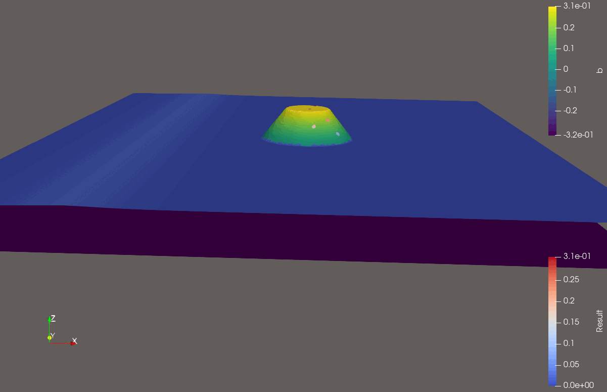
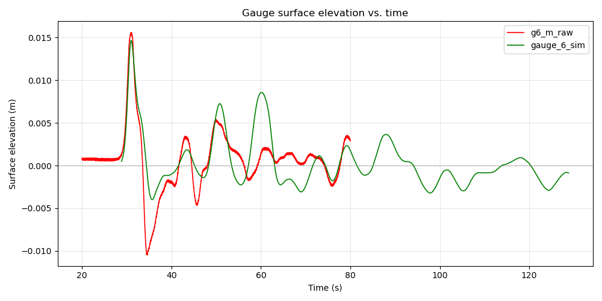
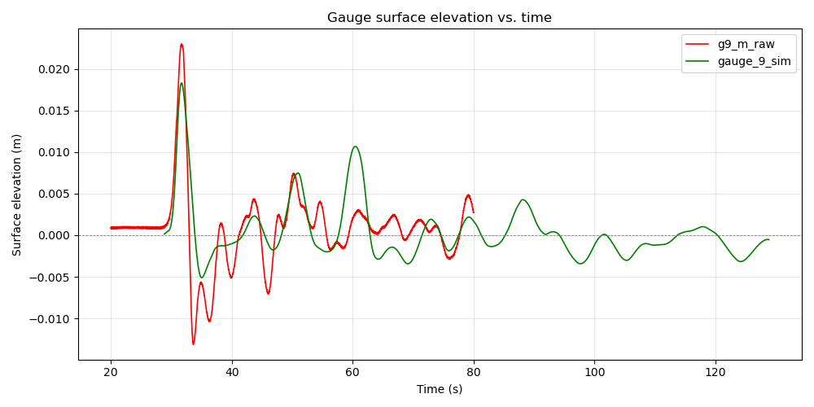
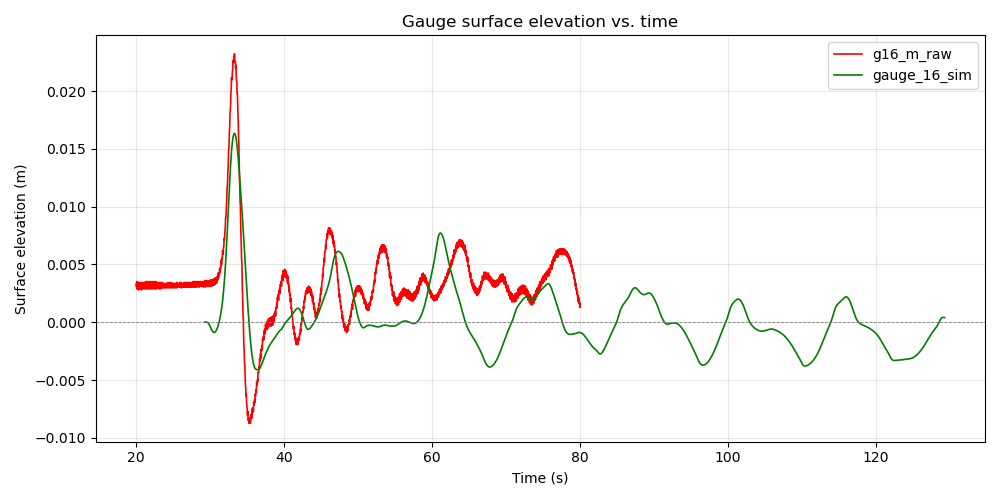
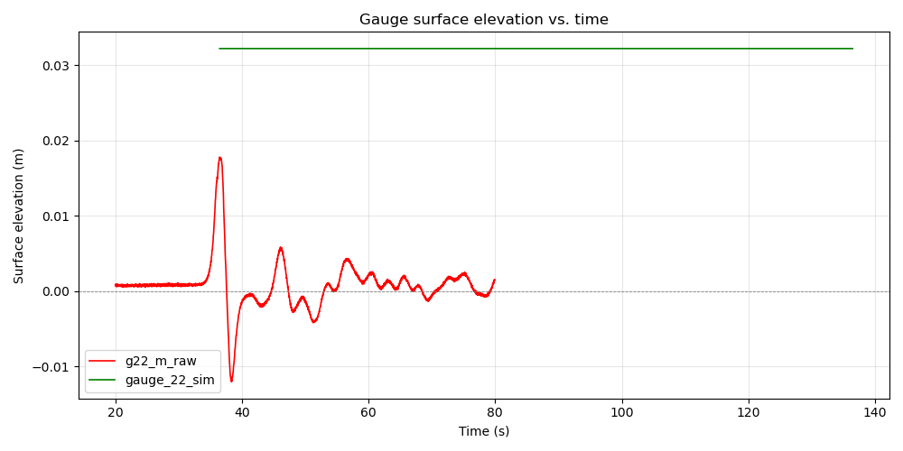

Woche 12
========

Dies ist die letzt Woche des Tsunami Labs. Wir haben 
die Zeit genutzt, um unsere aktuellen Ergebnisse zu validieren und 
weitere Simulationen zu testen.

Validierung
-----------

Die NOAA hat Richtlinien für die Validierung von Simulationsprogrammen für 
Tsunamis veröffentlicht. Laut diesen Richtlinien gibt es zwei Tests, welche 
ein solches Programm bestehen muss. 

1. Wassermenge:

Die Wassermenge sollte über den Verlauf von Simulationen Konstant bleiben. 
Wir haben dieses Kriterium überprüft, in dem zu Beginn und zum Ende einer Simulation 
die Menge des Wassers bestimmt wird.
Bei einer Beispielsimulation haben wir einen Wasserverlusst von 1.45% festgestellt. 
Laut NOAA ist eine Fluktuation der Wassermenge von 5% akzeptabel.  

2. Konvergenz an exakte Lösung:

Hier haben wir zwei vorgegebene Simulationssetups von unserem Solver simulieren lassen und 
diese mit bekannten Daten von der NOAA verglichen. 

Ein analytisch berechenbares Setup ist das sogenannte "Solitary Wave on canonical Beach" Setup.
Dieses Setup ist 1D und es besteht aus einer Welle, welch auf einen Strand trifft.
Durch die Einfachheit dieses Setups kann die Wasserhöhe an bestimmten Stellen analytisch ermittelt werden.
Die bekannten Lösungen haben wir zur Validierung unseres Solvers verwendet und den Runup auf den 
Beach visualisiert.

**Solitary Wave on canonical Beach**

**Vergleich mit exakter Lösung**

Als zweites haben wir das "Solitary Wave on canonical Island" Setup implementiert.
Das Setup ist 2D und die NOAA hat das Setup in echt nach gebaut um das Verhalten von 
verschiedenen Wellengrößen zu testen. Dabei wurden mehrere Stationen an unterschiedlichen 
Positionen platziert. An jeder Station wird die Wasserhöhe über den Verlauf der Zeit gemessen.
Diese Daten dienen als Validierungsgrundlage für unsere Tests. 

**NOAA Setup**

**Solitary Wave on canonical Island**

**Station 6 (Grün=Simulationsergebnis, Rot=NOAA-Daten)**

**Station 9 (Grün=Simulationsergebnis, Rot=NOAA-Daten)**

**Station 16 (Grün=Simulationsergebnis, Rot=NOAA-Daten)**

**Station 22 (Grün=Simulationsergebnis, Rot=NOAA-Daten)**

In der letzten Station ist zu erkennen, dass bei unserer Simulation die Welle nicht die Station erreicht hat, 
da diese Station auf der Insel in der Mitte sitzt. Somit haben wir die initiale Wellenhöhe vergrößert und 
kamen dann auf folgendes Ergebnis:

.. image:: ..images/gauge_22_raw_c_H0.064_vs_sim_H0.5.png

Man sieht, das zumindest die Peaks übereinstimmen. Man muss aber ehrlich sein und sagen, dass unser Solver 
nicht ganz so nah an die realen Daten kommt wie wir das uns vorgestellt hätten. Das könnte mehrere Gründe haben.
Zum Beispiel könnte die initiale Welle bei unserem Setup nicht mit der initialen Welle aus dem NOAA Setup übereinstimmen. 

Weitere Experimente
-------------------

**Solitary Wave on canonical Island (mega Welle)**

.. image:: ..images/swocb-5m.gif

**Small City Layout**

.. image:: ..images/small_city_layout.png

**Small City**

.. image:: ..images/small_city.gif

**Circular Dambreak Cap**

.. image:: ..images/dambreak_cap.gif