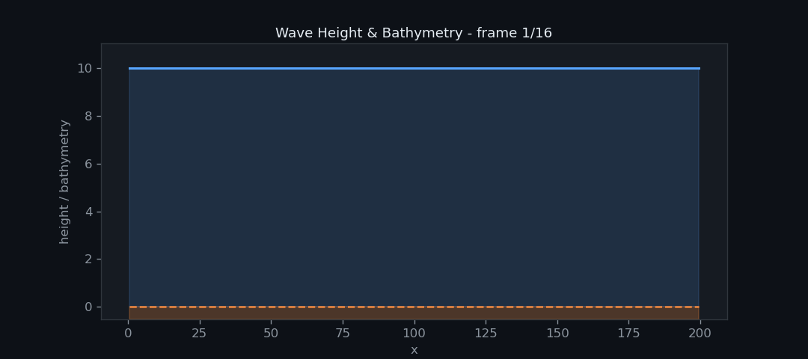
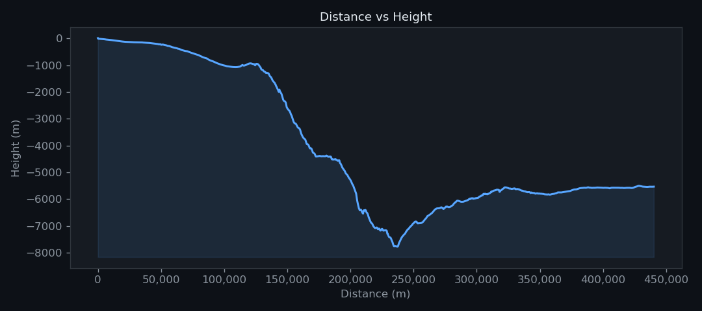
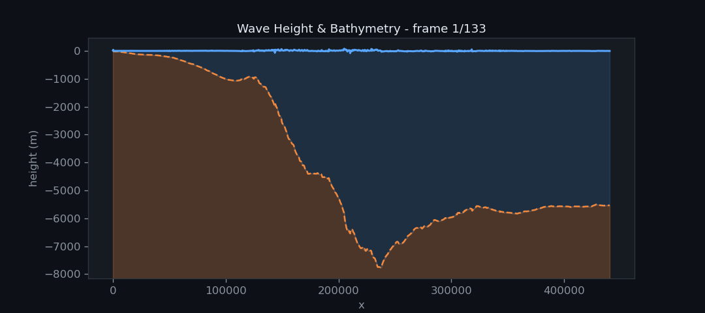
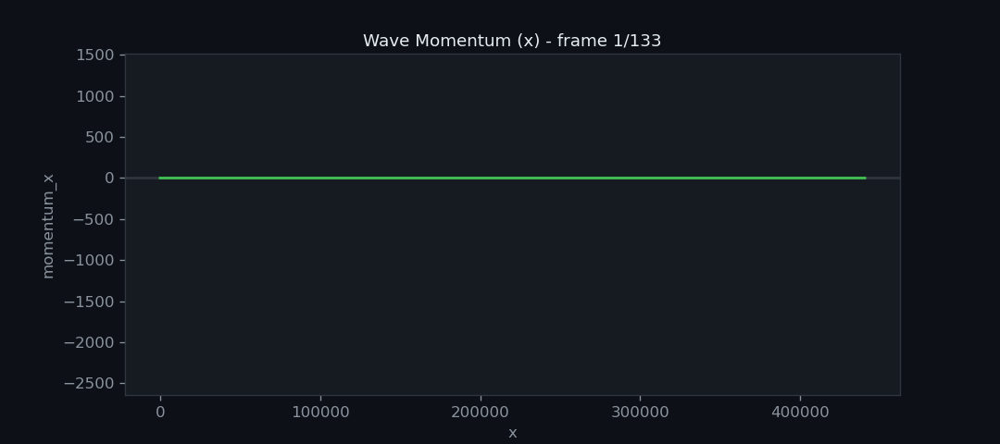
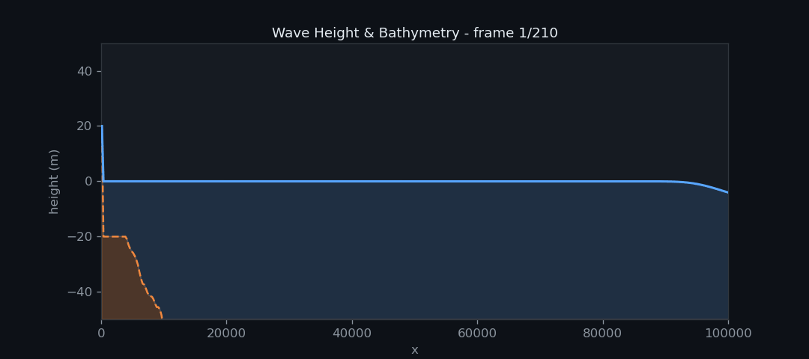

Woche 3
=======

In der dritten Woche des Tsunami Labs soll Bathymetry (Meeresgrund) in die Simulation eingeführt werden und
dabei muss der Umgang mit trockenen Zellen beachtet werden. Desweiteren soll dass 
Tsunami-Event von Fukushima mit korrekten Bathymetry-Daten simuliert werden. Letztendlich wird ein Effekt 
namens hydraulischer Sprung (oder Wechselsprung) analysiert.

Beiträge der Gruppenmitglieder
------------------------------

Gemeinsam
*********

Damit der F-Wave-Solver mit Bathymetry-Daten umgehen kann haben wir einen zusätzlichen 
Term in die Flux Funktion eingefügt. Die Bathymetry der linken und rechten Zelle 
wird dann einfach an die ``netUpdates`` Funktion übergeben.

Marvin Döring
*************

Visualisierung
~~~~~~~~~~~~~~

Für die bessere Visualisierung von Simulationsergebnissen verwenden wir ein Python-Skript.
Somit können wir die ausgegebenen CSV Dateien in GIFs umwandeln und hier auf der Dokumentationswebseite
präsentieren.

Reflektionen
~~~~~~~~~~~~

Um die Simulation stabil zu halten muss der Umgang mit trockenen Zellen implementiert werden.
Für diesen Spezialfall, wenn Wasser auf eine trockene Zelle trifft, lassen wir das Wasser 
einfach an dieser Zelle abprallen. Im Prinzip werden die gleichen Bedingungen, wie bei der Shock-Shock
Simulation eingeführt. In der ``WavePropagation1d`` Klasse wird überprüft ob 
die Wasserhöhe einer Zelle kleiner oder gleich Null ist. Wenn dies der Fall ist, dann wird 
dem F-Wave-Solver für die trockene Zelle die gleiche Wasserhöhe und Bathymetry wie die aus der
nassen Zelle mit gegeben. Das Momentum der trockenen Zelle ist allerdings das negative Momentum
der nassen Zelle.

Hier ist ein Vergleich zwischen der reflektierenden Wand und dem Shock-Shock Setup.

**Reflektion**

**Shock-Shock**

Wie zu erwarten sind die Ergebnisse, bis auf eine Verschiebung, identisch.

1D Tsunami Simulation
~~~~~~~~~~~~~~~~~~~~~

Um ein echtes Tsunami-Event zu Simulieren haben wir das `GEBCO_2026 Grid (ice surface elevation)`_ 
heruntergeladen und globale Bathymetry zu extrahiert. Für den Umgang mit den Rohdaten verwenden wir
die Python Bibilothek ``netCDF4``. Wir haben einen eindimensionalen Küstenstreifen vor 
Fukushima aus dem Datenset gelesen und in einer CSV Datei gespeichert.

.. _GEBCO_2026 Grid (ice surface elevation): https://www.gebco.net/data-products/gridded-bathymetry-data

**Küstenstreifen vor Fukushima**

Für das Einbinden der Bathymetry in die Simulation nutzen wir die ``tsunami_lab::io::Csv`` Klasse.
Die Klasse haben wir mit der Funktion ``readBathymetry`` erweitert, welche die Bathymetry aus der CSV Datei 
einlesen kann. Nach dem Einlesen werden die Daten an das neue ``TsunamiEvent1d`` Setup übergeben.
Dieses Setup simuliert ein Tsunami. 

**Tsunami Welle vor der Küsten von Fukushima**

**Momentum der Welle**

Die Welle ist aufgrund der Skalierung nicht gut zu erkennen, deshalb haben wir 
die Darstellung noch einmal etwas verändert

**Nähere Betrachtung der Welle**

Philipp Prell 
*************

