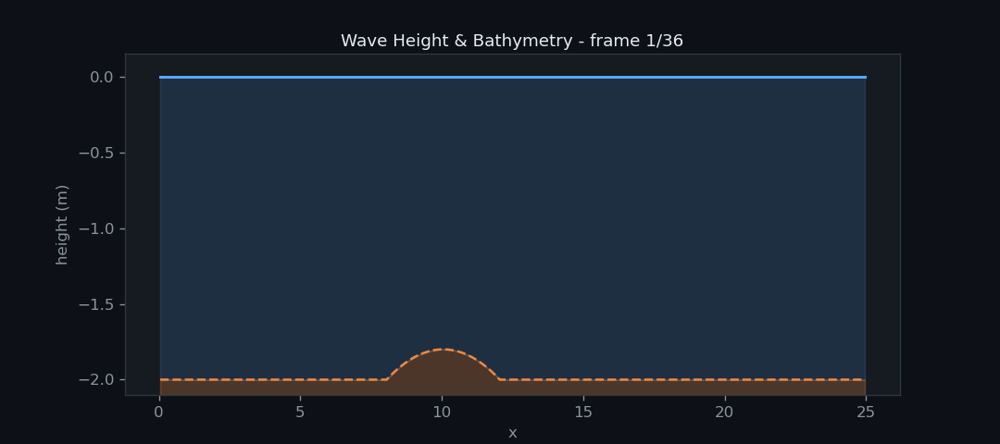
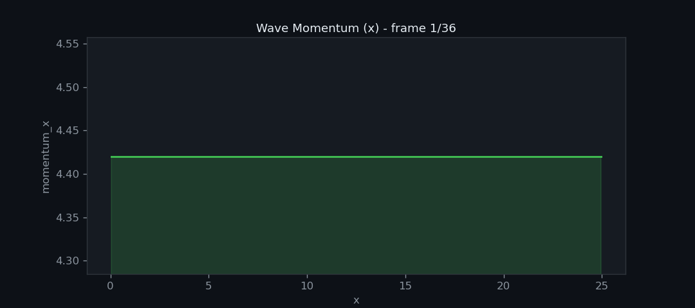
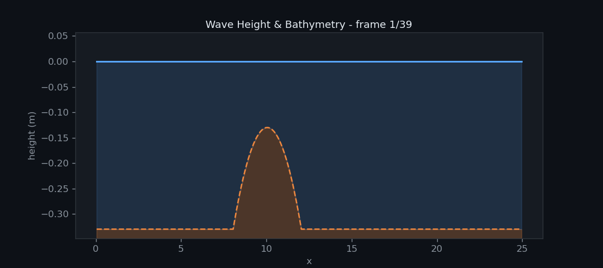
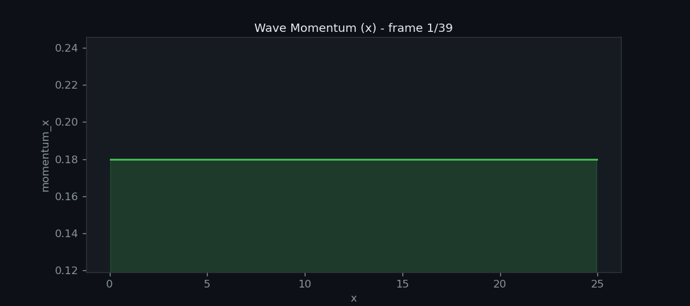
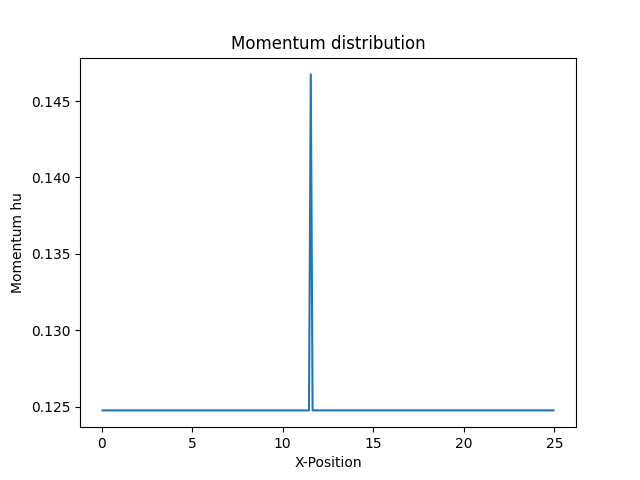

Woche 3
=======

In der dritten Woche des Tsunami Labs soll Bathymetry (Meeresgrund) in die Simulation eingeführt werden und
dabei muss der Umgang mit trockenen Zellen beachtet werden. Desweiteren soll dass 
Tsunami-Event von Fukushima mit korrekten Bathymetry-Daten simuliert werden. Letztendlich wird ein Effekt 
namens hydraulischer Sprung (oder Wechselsprung) analysiert.

Beiträge der Gruppenmitglieder
------------------------------

Gemeinsam
*********

Damit der F-Wave-Solver mit Bathymetry-Daten umgehen kann haben wir einen zusätzlichen 
Term in die Flux Funktion eingefügt. Die Bathymetry der linken und rechten Zelle 
wird dann einfach an die ``netUpdates`` Funktion übergeben.

Damit die Welle realistisch simuliert werden kann, haben wir die Klassen
``patches::WavePropagation`` sowie ``patches::WavePropagation1d`` so erweitert,
dass die Bathymetrie explizit berücksichtigt wird.
Für die Ghostzellen setzen wir dabei die Randwerte der Bathymetrie als
:math:b_0 := b_1 und :math:b_{n+1} := b_n.
Die Auswirkungen dieser Anpassung lassen sich besonders anschaulich in :ref:hydraulic_jumps
erkennen.

Marvin Döring
*************

Visualisierung
~~~~~~~~~~~~~~

Für die bessere Visualisierung von Simulationsergebnissen verwenden wir ein Python-Skript.
Somit können wir die ausgegebenen CSV Dateien in GIFs umwandeln und hier auf der Dokumentationswebseite
präsentieren.

Reflektionen
~~~~~~~~~~~~

Um die Simulation stabil zu halten muss der Umgang mit trockenen Zellen implementiert werden.
Für diesen Spezialfall, wenn Wasser auf eine trockene Zelle trifft, lassen wir das Wasser 
einfach an dieser Zelle abprallen. Im Prinzip werden die gleichen Bedingungen, wie bei der Shock-Shock
Simulation eingeführt. In der ``WavePropagation1d`` Klasse wird überprüft ob 
die Wasserhöhe einer Zelle kleiner oder gleich Null ist. Wenn dies der Fall ist, dann wird 
dem F-Wave-Solver für die trockene Zelle die gleiche Wasserhöhe und Bathymetry wie die aus der
nassen Zelle mit gegeben. Das Momentum der trockenen Zelle ist allerdings das negative Momentum
der nassen Zelle.

Hier ist ein Vergleich zwischen der reflektierenden Wand und dem Shock-Shock Setup.

**Reflektion**

.. image:: ../images/wave_height_bound.gif

**Shock-Shock**

.. image:: ../images/wave_height_shock.gif

Wie zu erwarten sind die Ergebnisse, bis auf eine Verschiebung, identisch.

1D Tsunami Simulation
~~~~~~~~~~~~~~~~~~~~~

Um ein echtes Tsunami-Event zu Simulieren haben wir das `GEBCO_2026 Grid (ice surface elevation)`_ 
heruntergeladen und globale Bathymetry zu extrahiert. Für den Umgang mit den Rohdaten verwenden wir
die Python Bibilothek ``netCDF4``. Wir haben einen eindimensionalen Küstenstreifen vor 
Fukushima aus dem Datenset gelesen und in einer CSV Datei gespeichert.

.. _GEBCO_2026 Grid (ice surface elevation): https://www.gebco.net/data-products/gridded-bathymetry-data

**Küstenstreifen vor Fukushima**

.. image:: ../images/coast_line_fukushima.png

Für das Einbinden der Bathymetry in die Simulation nutzen wir die ``tsunami_lab::io::Csv`` Klasse.
Die Klasse haben wir mit der Funktion ``readBathymetry`` erweitert, welche die Bathymetry aus der CSV Datei 
einlesen kann. Nach dem Einlesen werden die Daten an das neue ``TsunamiEvent1d`` Setup übergeben.
Dieses Setup simuliert ein Tsunami. 

**Tsunami Welle vor der Küsten von Fukushima**

.. image:: ../images/wave_height_fukushima.gif

**Momentum der Welle**

.. image:: ../images/wave_momentum_fukushima.gif

Die Welle ist aufgrund der Skalierung nicht gut zu erkennen, deshalb haben wir 
die Darstellung noch einmal etwas verändert

**Nähere Betrachtung der Welle**

.. image:: ../images/wave_height_fukushima_zoom.gif

Philipp Prell 
*************

Hydraulic Jumps
~~~~~~~~~~~~~~~

Da :math:`t = 0` kann man einfach die gegebene Höhe :math:`h(x,0)` und den Impuls :math:`hu(x,0)` verwenden.
Die Geschwindigkeit ergibt sich zu:

.. math::
    u(x,0) = \frac{hu(x,0)}{h(x,0)}.

Gesucht ist das Maximum der Froude-Zahl:

.. math::
    F_{t_0}(x,0) = \frac{u(x,0)}{\sqrt{g h(x,0)}} = \frac{hu(x,0)}{\sqrt{g h(x,0)^3}}.

Da in beiden Beispielen der Impuls konstant ist, hängt die Froude-Zahl nur von der Wassertiefe :math:`h(x,0)` ab.
Das Maximum wird daher dort erreicht, wo :math:`h(x,0)` minimal ist.

Physikalisch entspricht dies dem Punkt maximaler Strömungsempfindlichkeit, da kleine Änderungen der Wassertiefe dort den größten Einfluss auf die Wellenausbreitung haben.

Subcritical Flow
~~~~~~~~~~~~~~~~

Gegeben für :math:`x \in (0,25)`:

.. math::
    b(x) =
    \begin{cases}
        -1.8 - 0.05 (x-10)^2 \quad &\text{if } x \in (8,12) \\
        -2 \quad &\text{else}
    \end{cases}

.. math::
    h(x,0) = -b(x), \quad hu(x,0) = 4.42

Damit ergibt sich:

.. math::
    h(x,0) =
    \begin{cases}
        1.8 + 0.05 (x-10)^2 \quad &\text{if } x \in (8,12) \\
        2 \quad &\text{else}
    \end{cases}

Das Minimum von :math:`h(x,0)` ist:

.. math::
    \min_{x \in (0,25)} h(x,0) = 1.8 \quad \text{bei } x = 10.

Damit folgt:

.. math::
    F_{t_0}(10,0) =
    \frac{4.42}{\sqrt{9.81 \cdot 1.8^3}}
    \approx 0.58436

Der Fluss ist damit eindeutig subkritisch (:math:`F < 1`), was bedeutet, dass sich Störungen sowohl stromaufwärts als auch stromabwärts ausbreiten können.

Supercritical Flow
~~~~~~~~~~~~~~~~~~~~

Gegeben für :math:`x \in (0,25)`:

.. math::
    b(x) =
    \begin{cases}
        -0.13 - 0.05 (x-10)^2 \quad &\text{if } x \in (8,12) \\
        -0.33 \quad &\text{else}
    \end{cases}

.. math::
    h(x,0) = -b(x), \quad hu(x,0) = 0.18

Damit ergibt sich:

.. math::
    h(x,0) =
    \begin{cases}
        0.13 + 0.05 (x-10)^2 \quad &\text{if } x \in (8,12) \\
        0.33 \quad &\text{else}
    \end{cases}

Das Minimum ist:

.. math::
    \min_{x \in (0,25)} h(x,0) = 0.13 \quad \text{bei } x = 10.

Somit folgt:

.. math::
    F_{t_0}(10,0) =
    \frac{0.18}{\sqrt{9.81 \cdot 0.13^3}}
    \approx 1.2261

Der Fluss ist damit superkritisch (:math:`F > 1`), was bedeutet, dass Informationen nur stromabwärts propagieren können.

.. _hydraulic_jumps:

Subcritical Case
~~~~~~~~~~~~~~~~

Supercritical Case
~~~~~~~~~~~~~~~~~~

Hydraulic Jump – Momentum Profile
~~~~~~~~~~~~~~~~~~~~~~~~~~~~~~~~~~

.. _plot_momentum_distribution:

Versagen des f-wave Solvers
~~~~~~~~~~~~~~~~~~~~~~~~~~~~

erwartet wird, dass der impuls konstant bleibt, nachdem sich die Simulation eingependelt hat,
also dass :math:`hu = const`. In der Simulation :ref:`Momentum plot <plot_momentum_distribution>`
kann man eindeutig sehen, dass :math:`hu \approx 0.125`, außer für :math:`x = 11.55` ist :math:`hu(x) = 0.146742`.
das bedeutet, dass der f-wave solver einen fehler macht.
