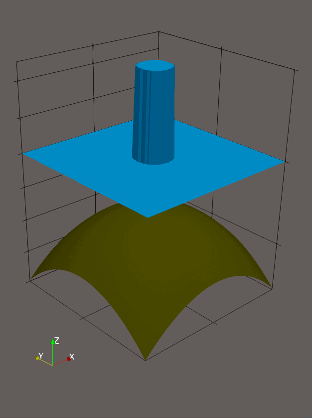
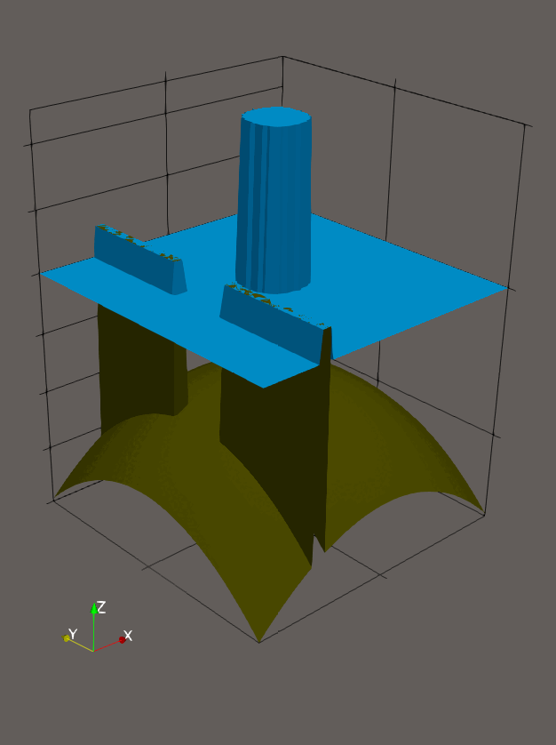
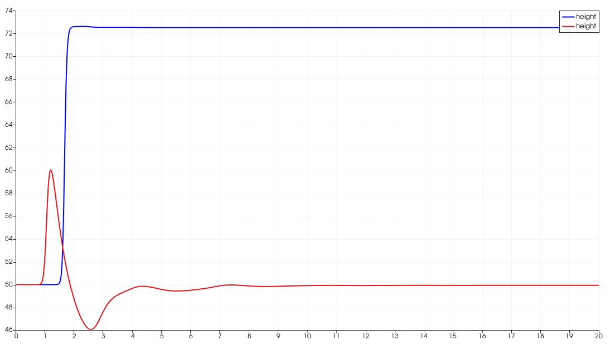
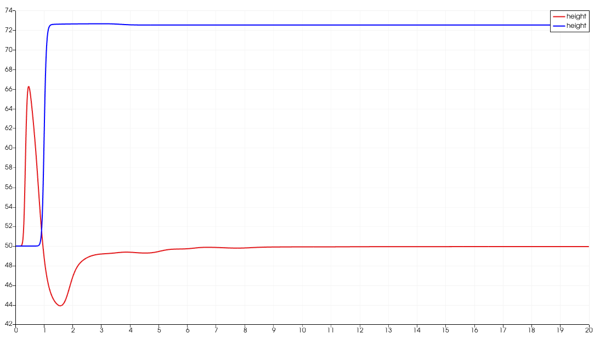
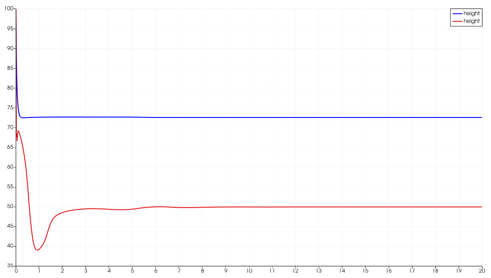

Woche 4
=======

In der vierten Woche des Tsunami-Labs wurde der Solver von einer
eindimensionalen auf eine zweidimensionale Variante erweitert.
Zusätzlich wurden sogenannte *Stations* eingeführt. Diese erfassen
an in einer YAML-Datei definierten Standorten verschiedene Messdaten,
wie beispielsweise die Wasserhöhe und die Bathymetrie.

Beiträge der Gruppenmitglieder
------------------------------

Gemeinsam
*********

Um die Berechnung in zwei Dimensionen zu ermöglichen, haben wir die
Klasse ``WavePropagation2d`` entwickelt. Diese berechnet die
``netUpdates`` getrennt für die X- und Y-Richtung und kombiniert
die Ergebnisse anschließend.

Damit die neue Klasse eingesetzt werden kann, wurde außerdem das
Setup ``CircularDamBreak2d`` implementiert. Dieses initialisiert
eine Bathymetrie im zweidimensionalen Raum und erzeugt in der Mitte
eine Wassersäule mit vorgegebenem Radius und definierter Höhe.

Marvin Döring
*************

Stations werden in ``tsunami_lab::io::Stations`` verwaltet und verarbeitet.
Über die Methode ``addStation`` können Stationen hinzugefügt werden.
Die von den Stationen erfassten Daten werden anschließend nach jedem
Zeitschritt mit ``write`` in eine CSV-Datei geschrieben.

Philipp Prell
*************

Es wurden Tests für ``WavePropagation2d`` sowie für
``CircularDamBreak2d`` implementiert. Zudem können Stations nun
auch direkt über eine YAML-Datei deklariert werden. Um die YAML-Datei
einzulesen nutzen wir das submodul *yaml-cpp*

Vergleich zwischen 2D und 1D
____________________________

Für den Vergleich zwischen der ein- und zweidimensionalen Simulation
wurden insgesamt drei *Stations* definiert.

In der zweidimensionalen Konfiguration befinden sich die Messpunkte
an den Positionen ``(10, 50)``, ``(30, 50)`` und ``(60, 50)``. Diese liegen alle entlang einer horizontalen Linie
durch das Simulationsgebiet (konstante Y-Koordinate).

Für die eindimensionale Simulation wurden entsprechende Positionen
entlang der X-Achse gewählt. Da hier nur eine Raumdimension existiert,
werden die Messpunkte durch die Koordinaten ``(10, 0)``, ``(30, 0)`` und
``(60, 0)`` beschrieben.

Durch diese analoge Platzierung der Stations ist es möglich, die
Ergebnisse beider Simulationen direkt miteinander zu vergleichen,
insbesondere hinsichtlich der zeitlichen Entwicklung der Wasserhöhe
an identischen X-Positionen.

X = 10
~~~~~~

X = 30
~~~~~~

X = 60
~~~~~~

