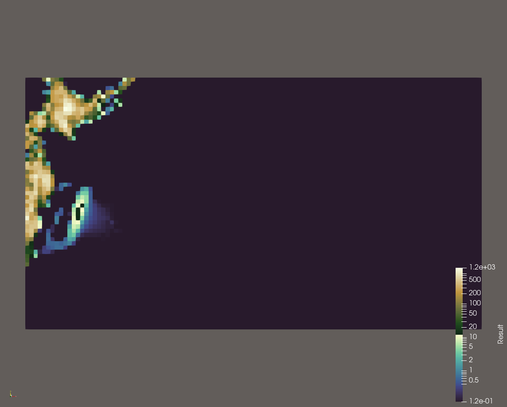
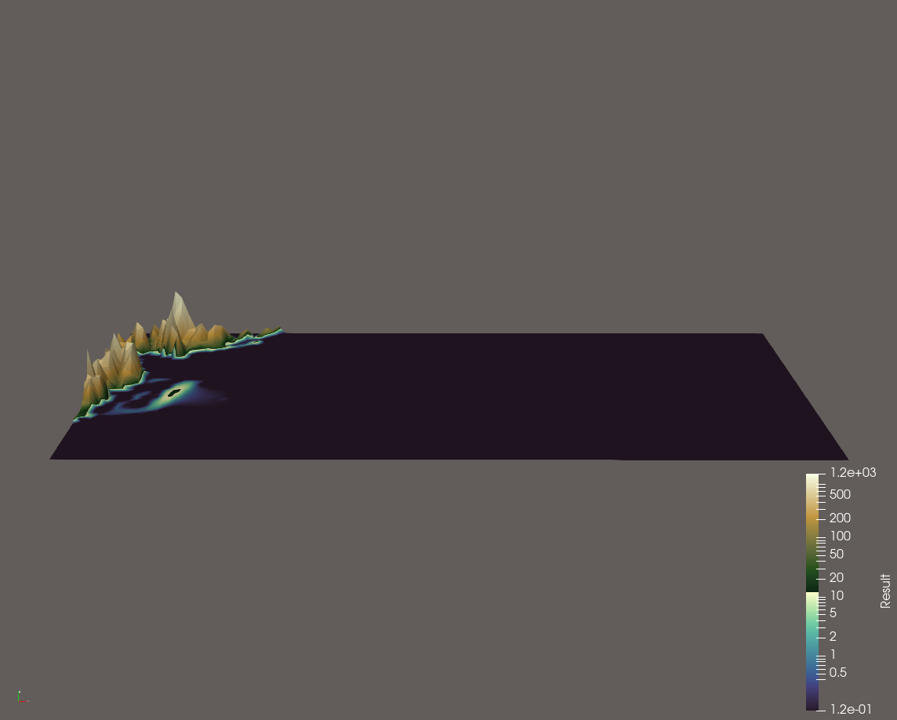

Woche 6
=======

...

Philipp Prell
*************

Zur Implementierung der Stations-Funktionalität wird nach jedem Zeitschritt, der von der
``NetCdf``-Klasse in die Solutions-Datei geschrieben wird, ein ``nc_sync()`` aufgerufen.
Dadurch wird der gesamte Puffer vollständig in den Speicher geschrieben.

Das Setup liest den letzten Zeitschritt aus der bestehenden NetCDF-Datei aus, indem die
Größe der Dimension ``time`` abgefragt und die Simulation an genau dieser Stelle fortgesetzt
wird. Daten wie Bathymetrie und Geschwindigkeit werden in den Puffer eingelesen und über
``Setup`` an die Wellenausbreitung (``WavePropagation``) übergeben.

Der Nutzer hat die Wahl, ob eine neue NetCDF-Datei angelegt oder die neue Simulation an
eine bestehende Datei angehängt werden soll.